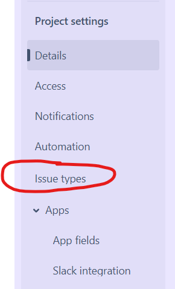
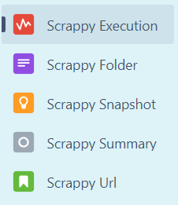
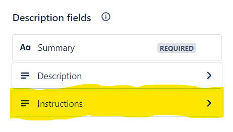
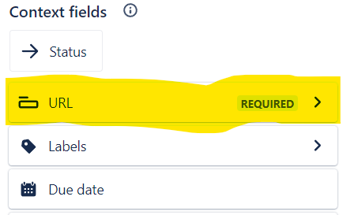

# Scrappy Jira Web Scrapper


## Introduction
Scrappy is a Web Scraping tool that uses Jira as its primary Jira Integrated Tool made to store snapshot of a website's data. 

## Prerequisites
 - Java
 - Maven
 - Atlassian Jira

## Build Instructions
1. Create an API token by going onto your server and visiting [/manage-profile/security/api-tokens](https://id.atlassian.com/manage-profile/security/api-tokens) on your server.
2. Add the following issue types by visiting Project Details.


3. In the URL Issue. 
   1. Add the 'Instructions' description field into the description
   2. Add the 'URL' url field into the context field.
   
   
4. Add the following issue links by going on your server and visiting [/secure/admin/ViewLinkTypes!default.jspa](https://atlassian.net/secure/admin/ViewLinkTypes!default.jspa) 
5. Follow the instructions on creating an execution tree. [Creating an execution tree](docs/creating-an-execution-tree.md)
6. Create a file '.settings' and in the file put the following text.
```
${Jira Server Url} Eg. https://USER.atlassian.net/
${Project} Eg. SCRAP
${Authentication Login} Eg. email or username
${API Token}
${Execution Jira Issue Key} Eg. SCRAP-1
```
5. To run the program, use the command `mvn compile exec:java`

## Documentation

[Creating an Execution Tree](docs/creating-an-execution-tree.md)
[Custom Jira Issues](docs/jira-issue.md)
[Adding Instructions](docs/adding-instructions.md)
[Instructions Syntax](docs/syntax.md)
