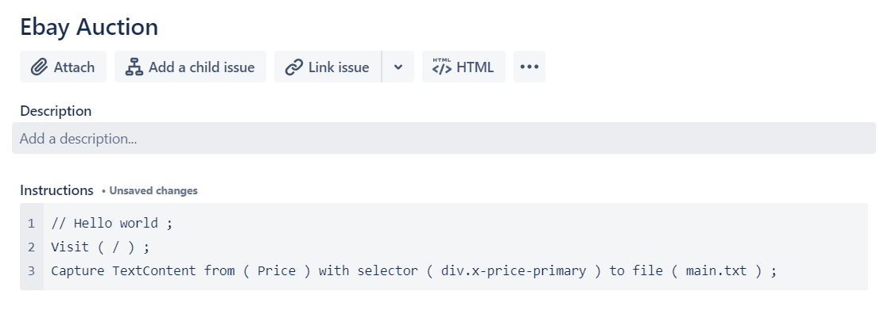

# Adding Instructions

Adding Instructions can be beneficial to the webpage you are trying to scrape for the following reasons.

1. You need customised actions to retrieve the additional amount of information. 
2. You want to add addition data to scrape.
3. You want to remove unnecessary data from artifacts.
4. You want to customise what is detected by the difference checker.

When Scrappy scrapes data from websites, it will upload all documents that are created. However, only the `main.txt` file is used for difference detection.

To view how to write instructions, visit [Instruction Syntax](syntax.md)

The default instructions are in the `default.instruction` file. To overwrite these instructions for a single url:
1. Open your Jira issue.
2. Create a code snippet by pressing + then code snippet or typing '```' (triple special quotes)
3. Enter your instructions.


Note that visit uses the relative url. 