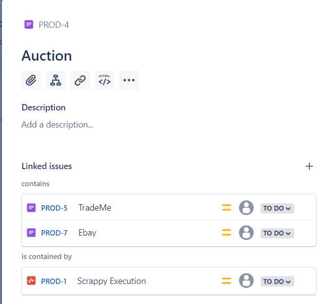

# Creating an Execution Tree

In this tutorial, we will be making the following execution tree.

- Execution: Scrappy Execution
  - Folder: Website Regression
    - URL: https://mingshanetong.github.io/
  - Folder: Auction
    - Folder: TradeMe
      - URL: https://faketrademelisting.com/
    - Folder: Ebay
      - URL: https://fakeebaylisting.com/

Steps:
1. Create tickets for every item in list of the respective type.
2. In each parent, connect to its child element using the 'contains'.

3. Finish. Set nodes to Done when not in use. 