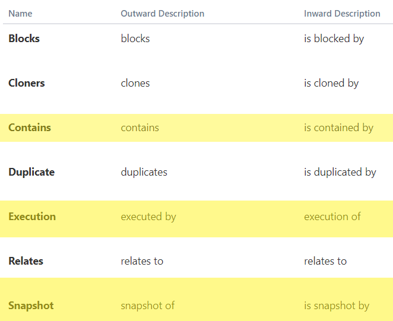

# Jira 
## Custom Issue Types
There are 5 custom Jira types.

### Scrappy Execution
The Jira used by the program to find urls to capture. Contains Folder and Url Issues.

### Scrappy Folder
Contains Url Issues. Used to group Url Issues together.

### Scrappy Url
Contains a url to test.

### Scrappy Snapshot
Contains data relating to a state of an url (created when the program is run).

### Scrappy Summary
Contains data relating to an execution of the program which summaries data from all snapshots.

## Issue Links
There are 2 types of custom Jira Links.

### Contains
Used by Execution and Folders to reference Folder or Url Issues. This is parsed as a part of the issue tree.

### Snapshot
Used by Snapshot issues to reference the Url Issue whose state is being captured in the snapshot.

### Execution
Used by Summary issues to reference the Execution issue that was executed.

### Issue Workflows

#### Scrappy Tree Workflow

Used to determine the state of an issue. Only issues InUse will be snapshot.

#### Scrappy Snapshot Workflow

Used by user to view newly create snapshots.
